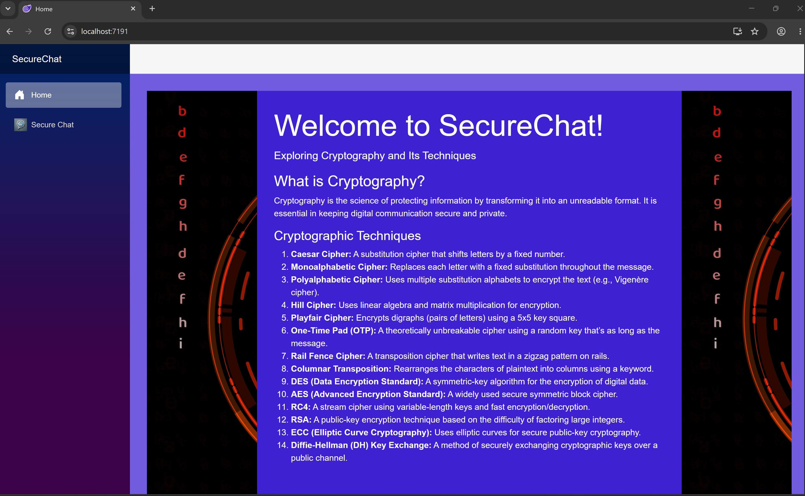
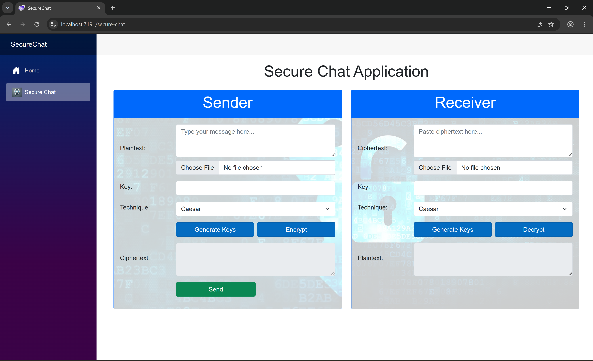

# SecureChat

A Blazor WebAssembly application built in C# that demonstrates how classical and modern cryptographic techniques protect messages. A sender encrypts a message with a chosen technique and key, and a receiver decrypts it, all in the browser.

> **Educational project.** SecureChat is built to demonstrate and learn cryptographic concepts. It has not been security audited and should not be used to protect real-world sensitive data.

## Screenshots

**Home page: overview of the techniques**



**Secure Chat page: sender and receiver panels**



## Features

- Separate **Sender** and **Receiver** panels: encrypt on one side, decrypt on the other
- 14 cryptographic techniques, selectable from a dropdown
- Key generation for the techniques that need it
- Text input, with an option to choose a file
- Home page that explains each technique
- Installable as a Progressive Web App (service worker and web manifest)

## Cryptographic techniques

All cryptographic logic lives in [`EncryptionTechniques.cs`](SecureChat/EncryptionTechniques.cs).

| Category | Techniques |
|----------|------------|
| Substitution ciphers | Caesar, Monoalphabetic, Polyalphabetic (Vigenère), Hill, Playfair |
| Perfect secrecy | One-Time Pad (OTP) |
| Transposition ciphers | Rail Fence, Columnar Transposition |
| Symmetric-key algorithms | DES, AES, RC4 |
| Public-key cryptography | RSA, ECC (Elliptic Curve Cryptography) |
| Key exchange | Diffie-Hellman (DH) |

| Technique | What it does |
|-----------|--------------|
| Caesar | Shifts letters by a fixed number |
| Monoalphabetic | Replaces each letter with a fixed substitute throughout the message |
| Polyalphabetic | Uses multiple substitution alphabets (e.g. Vigenère) |
| Hill | Uses linear algebra and matrix multiplication |
| Playfair | Encrypts pairs of letters using a 5x5 key square |
| One-Time Pad | Uses a random key as long as the message |
| Rail Fence | Writes text in a zigzag pattern across rails |
| Columnar Transposition | Rearranges characters into columns using a keyword |
| DES | Symmetric-key algorithm for encrypting digital data |
| AES | Widely used symmetric block cipher |
| RC4 | Stream cipher with variable-length keys |
| RSA | Public-key encryption based on factoring large integers |
| ECC | Public-key cryptography based on elliptic curves |
| Diffie-Hellman | Lets two parties agree on a shared key over a public channel |

## Tech stack

- C# and .NET 8.0
- Blazor WebAssembly with Razor components
- All cryptographic algorithms implemented from scratch in C#, without built-in cryptography libraries

## Project structure

```
SecureChat/
├── Model/
│   └── SecureChat.cs          # Chat message model
├── Pages/
│   ├── Home.razor             # Landing page explaining the techniques
│   └── Secure-Chat.razor      # Sender and receiver page
├── Layout/                    # App layout and navigation
├── wwwroot/                   # Static files: CSS, images, PWA manifest, service worker
├── EncryptionTechniques.cs    # Cryptographic implementations
└── Program.cs                 # App entry point
```

## Getting started

### Prerequisites

- [.NET SDK](https://dotnet.microsoft.com/download)
- Visual Studio 2022 (optional) or any editor that supports .NET

### Run locally

```bash
git clone https://github.com/debbyfash/SecureChat.git
cd SecureChat/SecureChat
dotnet run
```

Then open the URL printed in the terminal, or open the solution in Visual Studio and press **F5**.

## How to use

1. Open **Secure Chat** from the sidebar.
2. In the **Sender** panel, type a message, enter or generate a key, and pick a technique.
3. Click **Encrypt** to produce the ciphertext.
4. In the **Receiver** panel, paste the ciphertext, enter the key, pick the same technique, and click **Decrypt**.

## Limitations

- Built for learning, not for production use
- Some techniques here (Caesar, RC4, DES, and others) are historically important but no longer secure
- All algorithms are custom implementations written to learn how they work. They have not been tested against standard test vectors or audited, so they should not be used to protect real data
- Keys are generated in the browser and are not stored or persisted

## Author

**Deborah Faseun**
Cybersecurity professional | [LinkedIn](https://www.linkedin.com/in/deborah-faseun-4a939115a) | [GitHub](https://github.com/debbyfash)
